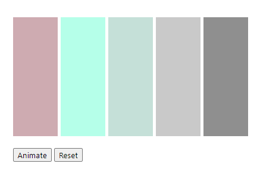

# Animated graph with CSS

- Using CSS variables to create a customizable animated graph

---

## Links

- [Live demo](https://js-animated-graph.rolandjlevy.repl.co/)
- [Source code](https://replit.com/@RolandJLevy/js-animated-graph)
- [Github repo](https://github.com/rolandjlevy/js-animated-graph)

## Screenshot

